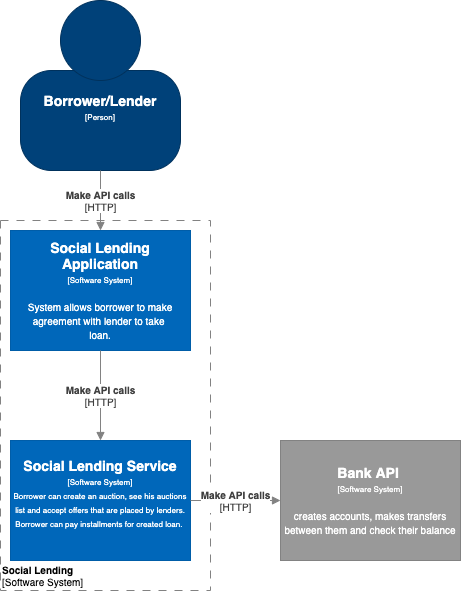
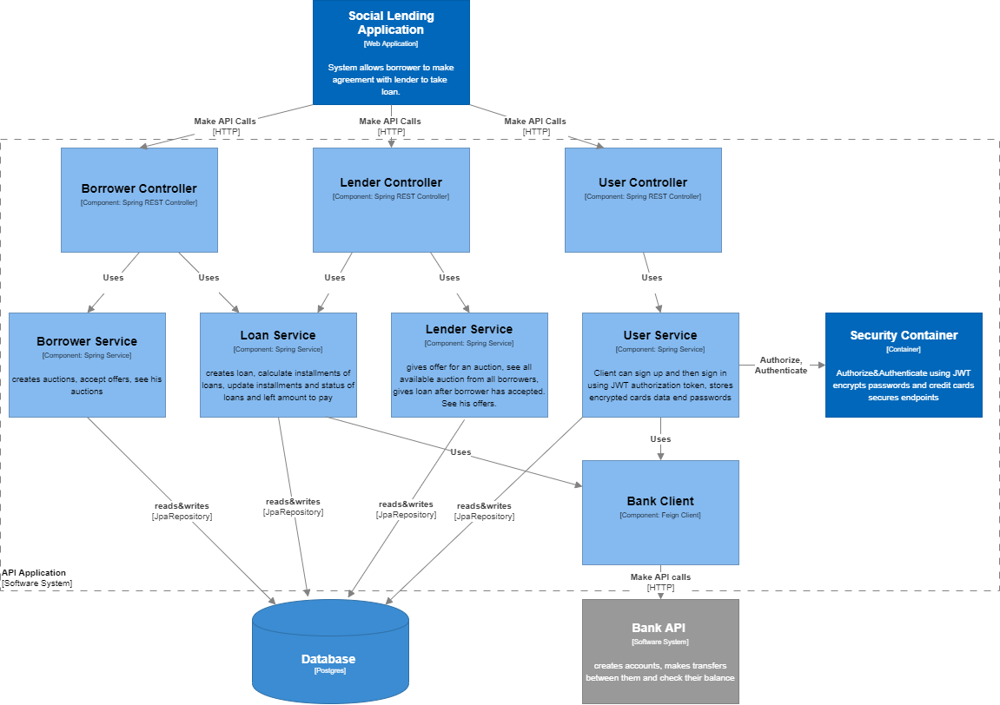

# Welcome to LendTree - The Social Lending App
## DevMountain aka Metis team are authors of this Social Lending service.

### Table of content
  1. Brief description how API works
  2. How to run application on local machine?
  3. Technology stack
  4. Context diagram
  5. Component Diagram
  6. Basic flow of events
  7. Initial informations

### 1. Brief description how API works
The main purpose of this application is to allow the users to borrow or lend money to each other. The user may create an account and attach a bank card to it. Each user can function both as a borrower and a lender.

#### User Features:
* Users can create an account with card details.
* Users can login.
* Users can deposit money into their account.
* Users can withdraw money from their account.
* Users can make external transfers from their account.
* Users can see details about their account.
* Users can view their transaction history.

#### Features of the User as a Borrower
* Borrowers can create an auction.
* Borrowers can see their auctions.
* Borrowers can view offers for their auctions.
* Borrower may accept an offer to their auction.
* Borrowers can see their loans.
* Borrowers can pay the installments of their loans.

#### Features of the User as a Lender
* Lenders can see the available auctions.
* Lenders can place an offer for a selected auction.
* Lenders can set an annual interest rate for their offer.
* Lenders may cancel their offer from an auction.
* Lenders can see their submitted offers.
* Lenders can see the loans they have granted.

#### API Security for users
To use API it is obligatory to create your own user profile and provide credit card details. 
In response to a login request user receives a JWT Token, which must be placed in ``Authorization``
header in format of ``Bearer <JWT Token>``. These two steps are unsecured with authentication. 
All other operations require the token.

### 2. How to run application on local machine?
If you haven't installed yet you will need Docker, Java-jdk11 and Apache Maven.

Here are steps how to do this:
1. Git clone this repository
2. Open command line, git bash or whatever you use in repository folder
3. Build applications docker image:
    ```
    docker build . -f Dockerfile.dev -t <image name>
    ```
    
    *For example:*
    ```
    docker build . -f Dockerfile.dev -t metissociallending
    ```
4. This command runs applications image (with ``--rm`` flag remove image on exit when you pass ``docker stop <container ID>``)
    ```
    docker run --rm -p 8080:8080/tcp <image name>:latest
    ```
    
    *For example:*
    ```
    docker run --rm -p 8080:8080/tcp metissociallending:latest
    ```
5. Application will be exposed at localhost:8080.

#### If service already started you can find API documentation under this link:
#### http://localhost:8080/swagger-ui.html
  
### 3. Technology stack
#### Technologies used:
* The application was written in Hexagonal architecture using the Command and Query interfaces.
* Authentication and authorization have been resolved using Json Web Token
* Hibernate
* The database used depends on the profiles:
  * At localhost H2 in memory database is used
  * At Sit, Uat and Prod PostgreSQL database is used.
* Feign Client connection to Bank Api
* JUnit5 with Mockito for tests
* Maven
* SpringFox Swagger - api documentation
* Lombok

#### Application has specified properties profiles for every environment:
* *Local* - profile that provides basic configuration for H2 database and logs
* *Sit* - has configured PostgreSQL database connection and logs
* *Uat* - has configured only PostgreSQL database connection
* *Prod* - same as Uat
* *Test* - is empty, but our target was to configure environment for testing like use of PostgreSQL TestContainer in integration testing

### 4. Context diagram
Diagram tells how API is placed in applications environment.


  
### 5. Component Diagram
This diagram shows application container. Here can be found components with their responsibility, technologies used and interactions between them.



### 6. Basic flow of events
1. User signs up and sings in.
  	1. If it fails system response with forbidden/unauthorized for other requests
2. Borrower creates auction.
3. Lender gives offer with annual rate for chosen auction.
4. Borrower chose and accepts offers.
5. System creates loan.
  	1. System transfers cash from lender to borrower account
  	2. System creates installments for given with time frames and amount to pay
  	3. System checks whether installment was paid in time
    	1. If installment wasn’t paid in time system calculate fines and marks them as missed
6. Borrower pay next installment
7. Cash with interests and possible fine are transferred to lender
8. Go to point 6 until all installments are paid

### 7. Initial informations
This is regular application created via spring.io. Have a look at:
* `Jenkinsfile` you'll find here how to build, push and deploy you application.
* `kubernetes.yaml` check IngressRoute to find out how publish your application with DNS name over HTTPS
* expose management port in you app and set readiness and liveness probes
* remember to push docker images to appropriate registry
* to keep registry easy-to-read, prefix your docker image with project name (ie. `metis-team/metis-social-lending-service`)
* in kubernetes steps use `fintech/kubernetes-agent` agent which contains git, kubectl, helm
* you don't have to specify kubernetes namespace - it's limited to project in which you build (ie. Training apps will be deployed to training namespace only)
* there are two kuberentes configurations available `kubeconfig-sit` and `kubeconfig-sit` (check Jenkinsfile)
* because of using tag `latest` you need to execute `kubectl rollout restart deployment metis-social-lending-service`
* use project as a DNS subdomain, to keep it clear (ie. `metis-social-lending-service.metis-team.fintechchallenge.pl`)
* protect your ingress with basic auth credentials (using Traefik middleware)
* in order to deploy application to production - use dedicated Jenkins job


Application is available here:
* SIT - https://metis-social-lending-service.metis-team.sit.fintechchallenge.pl/
* UAT - https://metis-social-lending-service.metis-team.uat.fintechchallenge.pl/
* PROD - https://metis-social-lending-service.metis-team.fintechchallenge.pl/
